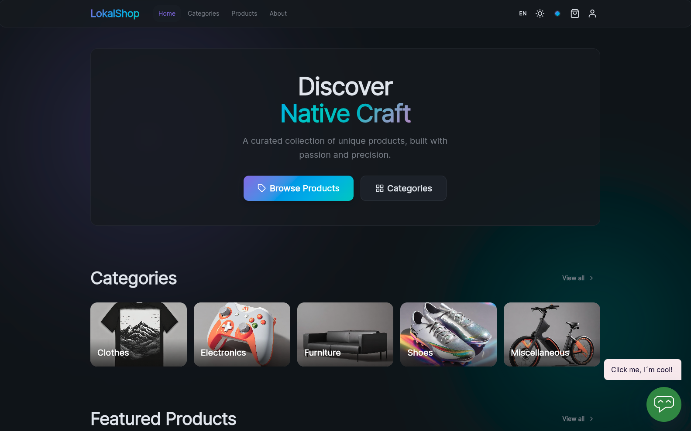
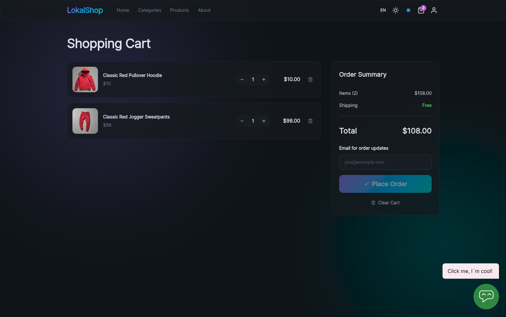
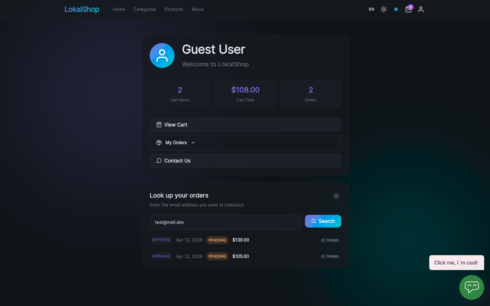
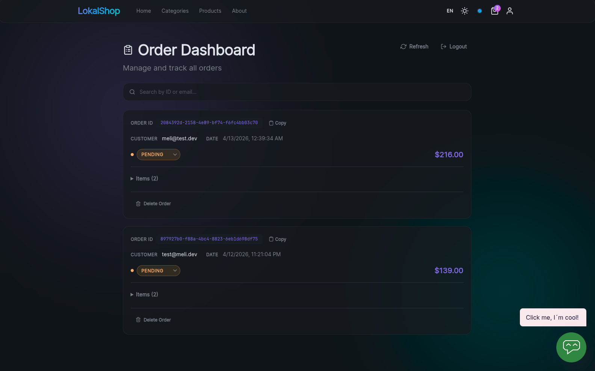

# LokalShop

**Spanish version:** this guide is also available in [README_ES.md](README_ES.md).

Demo e-commerce store built with **SvelteKit**, **adapter-static** (GitHub Pages), **IndexedDB** for cart and cache, **Supabase** for cloud orders, and **melibo** for chat and the contact form.

|                    Home                     |                      Cart                       |
| :-----------------------------------------: | :---------------------------------------------: |
|  |  |

|                     My orders                      |                       Admin dashboard                        |
| :------------------------------------------------: | :----------------------------------------------------------: |
|  |  |

---

## Prerequisites

- **Node.js** 25.9.0 (see `package.json` → `engines` and `mise.toml`)
- **pnpm** — this project uses **only** `pnpm` for dependencies and scripts

Install pnpm (if needed):

```bash
corepack enable
corepack prepare pnpm@10.33.0 --activate
```

---

## 1. Clone and install dependencies

```bash
git clone https://github.com/alejandro-ser/lokalShop.git
cd lokalShop
pnpm install
```

`pnpm install` respects `pnpm-lock.yaml` and sets up the environment for development and builds.

---

## 2. Environment variables (`.env`)

Copy the example and edit it:

```bash
cp .env.example .env
```

Expected contents of **`.env.example`** / **`.env`** (all are `PUBLIC_*` so Vite and SvelteKit inject them at build time via `$env/static/public`):

| Variable                    | Description                                                |
| --------------------------- | ---------------------------------------------------------- |
| `PUBLIC_API_BASE`           | Base URL for the product API (default: Platzi Fake Store). |
| `PUBLIC_SUPABASE_URL`       | Your Supabase project URL.                                 |
| `PUBLIC_SUPABASE_ANON_KEY`  | Supabase anonymous (`anon` / `public`) key.                |
| `PUBLIC_ADMIN_HASH`         | SHA-256 hash of the admin secret (see Admin section).      |
| `PUBLIC_MELIBO_WIDGET_KEY`  | melibo chat widget key.                                    |
| `PUBLIC_MELIBO_CONTACT_KEY` | melibo contact form channel key for `/contacto`.           |

After changing `.env`, regenerate SvelteKit types:

```bash
pnpm exec svelte-kit sync
```

---

## 3. Product API (Platzi Fake Store)

Product and category listings come from an HTTP API configured with **`PUBLIC_API_BASE`**.

- **Docs / explorer:** [Fake Store API (EscuelaJS)](https://fakeapi.platzi.com/) — endpoints, filters, and data shape.
- **Typical base URL:** `https://api.escuelajs.co/api/v1`  
  In `.env`:

```env
PUBLIC_API_BASE=https://api.escuelajs.co/api/v1
```

You do not need a Platzi account just to use the public API; the correct URL is enough.

---

## 4. Supabase (cloud orders)

Checkout stores orders in **IndexedDB** and in parallel in Supabase (table `orders`) for the admin panel, profile “my orders”, and integrations (e.g. melibo).

### 4.1 Create a project

1. Go to [Supabase](https://supabase.com/) and sign in.
2. **New project** → pick organization, name, region, and database password.
3. In the project dashboard: **Settings → API**:
   - Copy **Project URL** → `PUBLIC_SUPABASE_URL`
   - Copy **anon public** key → `PUBLIC_SUPABASE_ANON_KEY`

### 4.2 `orders` table

In **SQL Editor** (Supabase → **SQL Editor**) you can create a table aligned with the app’s `Order` type (`src/lib/types/api.ts`). Minimal example:

```sql
create table if not exists public.orders (
  id uuid primary key default gen_random_uuid(),
  status text not null default 'pending',
  items jsonb not null default '[]'::jsonb,
  total_amount numeric(12,2) not null,
  customer_email text not null,
  created_at timestamptz not null default now(),
  updated_at timestamptz not null default now()
);

alter table public.orders enable row level security;
```

Adjust types or the `id` default if your code generates the UUID on the client (then `id` can be `text` or `uuid` without a DB default).

### 4.3 Row Level Security (RLS)

Without suitable policies, client `insert`/`update`/`delete` may **affect no rows** with no obvious error. Configure policies for the **`anon`** role according to your security model (demo: often wide open for testing; in production restrict by user or use Edge Functions).

---

## 5. melibo (chat and contact form)

- **melibo dashboard:** [melibo](https://melibo.de) (sign in to your account).
- **Chat widget:** create or open a **widget / chat channel** and copy the widget **key** → `PUBLIC_MELIBO_WIDGET_KEY` (used in `+layout.svelte` when loading `melibo-widget`).
- **Contact form:** create a **form / contact channel** and copy the **channel-key** (or whatever the docs call it) → `PUBLIC_MELIBO_CONTACT_KEY` (`/contacto` page).

If these variables are empty, the app still runs; the widget and external form simply will not load.

---

## 6. Admin password (`PUBLIC_ADMIN_HASH`)

Access to **`/admin-preview`** compares a browser-side hash with the value baked into `PUBLIC_ADMIN_HASH`.

1. Pick a **username** and **password** (demo only).
2. The expected hash is **SHA-256 in hexadecimal** of the string:

   `username:password`  
   (literally a colon between username and password, no extra spaces).

3. Generate the hash in the terminal:

```bash
printf '%s' 'myUser:myStrongPassword' | shasum -a 256
```

On Linux without `shasum`:

```bash
printf '%s' 'myUser:myStrongPassword' | sha256sum
```

4. Copy only the **64 hex characters** into `.env`:

```env
PUBLIC_ADMIN_HASH=abcdef0123...
```

5. On the admin login screen use **exactly** the same `myUser` and `myStrongPassword`.

---

## 7. Development server

```bash
pnpm dev
```

Open [http://localhost:5173](http://localhost:5173) (or the URL Vite prints).

Useful routes:

| Route                      | Purpose                             |
| -------------------------- | ----------------------------------- |
| `/`                        | Home                                |
| `/products`, `/categories` | Catalog                             |
| `/cart`                    | Cart and checkout (email + order)   |
| `/profile`                 | Profile and order lookup by email   |
| `/contacto`                | melibo contact form                 |
| `/admin-preview/login`     | Admin login                         |
| `/admin-preview`           | Orders dashboard (requires session) |

---

## 8. Production build

```bash
pnpm build
pnpm preview
```

Static output in **`build/`**, intended for **GitHub Pages** with `fallback: '404.html'` in `svelte.config.js`.

---

## 9. Deploy on GitHub Pages (CI/CD)

The **`.github/workflows/deploy.yml`** workflow installs with `pnpm`, runs `pnpm build` injecting **`PUBLIC_*` secrets**, and publishes the artifact to **GitHub Pages**.

In the repo: **Settings → Secrets and variables → Actions** — add the same names as in `.env` (e.g. `PUBLIC_SUPABASE_URL`, `PUBLIC_ADMIN_HASH`, etc.).

Under **Settings → Pages**: source **GitHub Actions** (not the classic `gh-pages` branch unless you change it).

For a repo at **`username.github.io/repo-name/`**, the workflow sets `BASE_PATH` to `/${{ github.event.repository.name }}` so links and assets resolve correctly.

---

## 10. Useful scripts (`package.json`)

| Command        | Description                 |
| -------------- | --------------------------- |
| `pnpm dev`     | Development server          |
| `pnpm build`   | Static build                |
| `pnpm preview` | Preview the build           |
| `pnpm check`   | `svelte-check` + TypeScript |
| `pnpm lint`    | Prettier + ESLint           |

---

## 11. Local data (IndexedDB)

The IndexedDB database name is in `src/lib/services/db.ts` (`DB_NAME`). If you change it, the browser uses a new database (empty cart and cache).

---

## License and demo data

Legal copy and the catalog are illustrative; the Platzi API serves fictitious data. Adjust Impressum, privacy, and RLS before real-world use.
